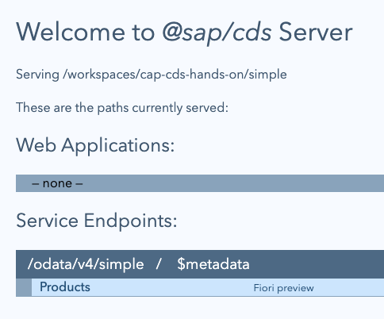

# 02 - Understand the basic model, service and persistence features

In the previous exercise we conjured up a simple but fully functional OData
service from a declarative definition that is just a few lines long. In this
exercise we'll explore what we have - to understand the central importance of
the model, what the service is, and how the definition relates to a database
layer.

## Explore the service

👉 Open up <http://localhost:4004/> in your browser to see the default CAP
server landing page:



### Make some read requests

👉 Examine some of the resources available via the various hyperlinks:

- [http://localhost:4004/odata/v4/simple](http://localhost:4004/odata/v4/simple)
  (the OData service document)
- [http://localhost:4004/odata/v4/simple/\$metadata](http://localhost:4004/odata/v4/simple/$metadata)
  (the OData metadata document)
- [Fiori
  preview](http://localhost:4004/$fiori-preview/Simple/Products#preview-app) (a
  basic Fiori elements List Report app)
- [http://localhost:4004/odata/v4/simple/Products](http://localhost:4004/odata/v4/simple/Products)
  (an entityset with the Products data)

👉 Based on this last products entityset resource, try out some standard OData
URL-based query mechanisms (admittedly these are somewhat limited, given the
rather limited nature of our dataset), such as:

- [http://localhost:4004/odata/v4/simple/Products/3](http://localhost:4004/odata/v4/simple/Products/3)
  (retrieve the Product with ID 3)
- [http://localhost:4004/odata/v4/simple/Products?\$filter=contains(name,%27Syrup%27)](http://localhost:4004/odata/v4/simple/Products?$filter=contains(name,'Syrup'))
  (return an entityset with products that have "Syrup" in their name)
- [http://localhost:4004/odata/v4/simple/Products?\$select=name](http://localhost:4004/odata/v4/simple/Products?$select=name)
  (all the products, just with the name property for each entity)

  > By default the key property (`ID` here) is returned as well.

### Try some write requests too

At the shell prompt, try one or more of these:

👉 Add a new product[<sup>1</sup>](#footnotes):

```bash
# Get the latest product ID
lastid="$(
  curl -s 'localhost:4004/odata/v4/simple/Products?$orderby=ID%20desc&$top=1' | \
    jq '.value|first|.ID'
)"

# Increment the ID
nextid="$((lastid + 1))"

# Send an OData create operation with the incremented ID
curl \
  --silent \
  --header 'Content-Type: application/json' \
  --data '{"ID":'"$nextid"',"name":"New Product ('"$nextid"')","stock":10}' \
  --url 'localhost:4004/odata/v4/simple/Products' \
  | jq .
```

👉 Change the name of product ID 3:

```bash
curl \
  --silent \
  --request PATCH \
  --header 'Content-Type: application/json' \
  --data '{"name": "Aniseed Sauce"}' \
  --url 'localhost:4004/odata/v4/simple/Products/3' \
  | jq .
```

👉 Remove the "Chai" product:

```bash
curl \
  --include \
  --request DELETE \
  --url 'localhost:4004/odata/v4/simple/Products/1'
```

> The `--include` option tells `curl` to show the response headers.

## Understand how the definition is used

These days it's hard to imagine how much work it used to be, before the advent
of CAP, to get an OData service like this up and running and providing full
support for the entire set of service operations.

But that's not the point of this exercise nor this workshop. Instead, let's
take a quick look at what "descends" from our simple model definition.

The definition is written using the Conceptual Definition Language
([CDL](https://cap.cloud.sap/docs/cds/cdl)), the human-readable form of the
declarative language designed to be used by domain experts and developers to
create the domain model as the foundation for the solution to the business
need.

### Get an introduction to Core Schema Notation

The CAP server uses the CDS model definition to provide an appropriate OData
service here, by default and out of the box. But it uses it in a more readily
machine-readable form called Core Schema Notation
([CSN](https://cap.cloud.sap/docs/cds/csn), pronounced "season") and which can
come in two common representations - JSON and YAML.

Let's remind ourselves of the CDS model we have, written in CDL:

```cds
service Simple {
  entity Products {
    key ID    : Integer;
        name  : String;
        stock : Integer;
  }
}
```

#### CSN in JSON

👉 Generate the CSN equivalent of this model, in a JSON representation:

```bash
cds compile --to json services.cds
```

This emits:

```json
{
  "definitions": {
    "Simple": {
      "@source": "services.cds",
      "kind": "service"
    },
    "Simple.Products": {
      "kind": "entity",
      "elements": {
        "ID": {
          "key": true,
          "type": "cds.Integer"
        },
        "name": {
          "type": "cds.String"
        },
        "stock": {
          "type": "cds.Integer"
        }
      }
    }
  },
  "meta": {
    "creator": "CDS Compiler v6.8.0",
    "compilerCsnFlavor": "inferred",
    "flavor": "inferred"
  },
  "$version": "2.0"
}
```

> This is a very common request and so can also be produced with the shorter
> `cds c .`, where `.` is a reference to the current directory, which only
> contains a single `services.cds` source file at this point anyway.
>
> The output emitted to the terminal from this command (which doesn't
> explicitly use the `--to json` option) is not strictly JSON, it's actually a
> syntactically valid JavaScript object, mostly because it's easier on the eye
> ... and if the output is sent downstream to a file or process, then JSON is
> indeed created.

While JSON is arguably the default, YAML is arguably easier on the eye so we'll
use that as our go-to representation throughout this workshop whenever we want
to look at CSN.

#### CSN in YAML

👉 Re-generate the CSN equivalent of this model, this time in a YAML representation:

```bash
cds compile --to yaml services.cds
```

This emits:

```yaml
definitions:
  Simple: { kind: service }
  Simple.Products:
    kind: entity
    elements:
      {
        ID: { key: true, type: cds.Integer },
        name: { type: cds.String },
        stock: { type: cds.Integer },
      }
meta: { creator: CDS Compiler v6.4.6, flavor: inferred }
$version: 2.0
```

> For purposes of display and readability in these workshop exercises, the YAML
> has been passed through [Prettier](https://prettier.io/), "an opinionated
> code formatter", largely to split long lines up.
>
> For example, the specifically formatted YAML here was produced like this:
>
> ```bash
> cds compile --to yaml services.cds \
>   | prettier --parser yaml --print-width 60
> ```
>
> You can try this yourself if you wish, as `prettier` [has been included in
> the container image build](../../.devcontainer/Dockerfile#L11) used for these
> exercises.

While we won't need to look much further at CSN in this workshop, it's
important to understand that it exists and is the "processable" version of the
definitions we construct in our CDS models. We'll occasionally use CSN in
subsequent exercises to support our understanding, where appropriate.

### SQL and DDL

At some point the data model part of our definitions will need to have some
form of presence at a persistence layer. In other words, we'll want to store
the data in our model, the records that make up the data in our entities, and
the projections upon them, and so on.

When we started our CAP server with `cds watch` earlier, this compiled the CDL
into SQL (more accurately
[DDL](https://en.wikipedia.org/wiki/Data_definition_language), a specific
syntax in the SQL world for defining database objects themselves, rather than
working with the data within), in order to be able to deploy the data model to
a persistence layer.

In development mode, by default, this persistence layer is provided by the
quietly powerful and ubiquitous [SQLite](https://sqlite.org/) database engine.
Also by default in this context, it will be started in "in-memory" mode, i.e.
ephemeral persistence (if that is not an oxymoron) for the duration of the CAP
server's lifetime. This is incredibly useful for rapid turnaround and
local-first development.

When looking at the log output from the CAP server in the previous exercise, we
saw:

```log
[cds] - connect to db > sqlite { url: ':memory:' }
  > init from db/data/Simple.Products.csv
/> successfully deployed to in-memory database.
```

This reflects what's happening - the model is compiled and deployed to a SQLite
powered in-memory persistence layer.

> This mode is employed directly because of the design-time options we
> requested implicitly with `cds watch`, which were (as you also may have
> noticed in the log output): `cds serve all --with-mocks --in-memory?`.

👉 Take a look at what that looks like by asking for the SQL equivalent:

```bash
cds compile --to sql services.cds
```

This emits:

```sql
CREATE TABLE Simple_Products (
  ID INTEGER NOT NULL,
  name NVARCHAR(255),
  stock INTEGER,
  PRIMARY KEY(ID)
);
```

> There's also the HANA specific equivalent for when deployment is to an SAP
> HANA powered persistence layer, which can be summoned with `cds compile --to
> hana services.cds` and looks like this:
>
> ```sql
> ----- Simple.Products.hdbtable -----
> COLUMN TABLE Simple_Products (
>   ID INTEGER NOT NULL,
>   name NVARCHAR(5000),
>   stock INTEGER,
>   PRIMARY KEY(ID)
> )
> ```

## Deployments (bonus)

If you're curious about how this ends up in an SAP HANA context,
you can prepare a deployment to see what's generated, and inspect
the individual assets such as HDI container artifacts and table data (`.hdbtable`)
files.

### Run a build task for HANA

The builder is capable and can run tasks for different targets ([types](https://cap.cloud.sap/docs/guides/deploy/build#build-task-types)).

👉 Specify a build for the `hana` target:

```bash
cds build --for hana
```

which will produce output something like this:

```log
building project with {
  versions: { cds: '9.8.4', compiler: '6.8.0', dk: '9.8.3' },
  target: 'gen',
  tasks: [
    { src: 'db', for: 'hana', options: { model: [ 'db', 'srv', 'app', 'app/*', 'services', '@sap/cds/srv/outbox' ] } }
  ]
}
done > wrote output to:
   gen/db/package.json
   gen/db/src/gen/.hdiconfig
   gen/db/src/gen/.hdinamespace
   gen/db/src/gen/Simple.Products.hdbtable
   gen/db/src/gen/cds.outbox.Messages.hdbtable

build completed in 87 ms
```

You can now take a peek inside the `gen/db/src/gen/Simple.Products.hdbtable`
file that contains the DDL for the single entity we have so far:

```sql
COLUMN TABLE Simple_Products (
  ID INTEGER NOT NULL,
  name NVARCHAR(5000),
  stock INTEGER,
  PRIMARY KEY(ID)
)
```

### Deploy to a SQLite database file

And to finish off, back to design (non-production) time, you can even deploy to
a SQLite database file which you can explore using the SQLite command line interface.

👉 Use this command:

```bash
cds deploy --to sqlite:test.db
```

which emits something like this:

```log
  > init from db/data/Simple.Products.csv
/> successfully deployed to test.db

```

👉 Then invoke the SQLite command line interface, specifying the name of the
file created:

```bash
sqlite3 test.db
```

This gives you a prompt:

```log
SQLite version 3.46.1 2024-08-13 09:16:08
Enter ".help" for usage hints.
sqlite>
```

where you can, for example:

- explore with commands such as `.tables`:

    ```log
    sqlite> .tables
    Simple_Products      cds_outbox_Messages
    ```

- request data with `select * from Simple_Products;`

    ```log
    sqlite> select * from Simple_Products;
    1|Chai|39
    2|Chang|17
    3|Aniseed Syrup|13
    ```

- query the schema with `select * from sqlite_schema;`

    ```log
    sqlite> select * from sqlite_schema;
    table|Simple_Products|Simple_Products|2|CREATE TABLE Simple_Products (
      ID INTEGER NOT NULL,
      name NVARCHAR(255),
      stock INTEGER,
      PRIMARY KEY(ID)
    )
    table|cds_outbox_Messages|cds_outbox_Messages|3|CREATE TABLE cds_outbox_Messages (
      ID NVARCHAR(36) NOT NULL,
      timestamp TIMESTAMP_TEXT,
      target NVARCHAR(255),
      msg NCLOB,
      attempts INTEGER DEFAULT 0,
      "partition" INTEGER DEFAULT 0,
      lastError NCLOB,
      lastAttemptTimestamp TIMESTAMP_TEXT,
      status NVARCHAR(23),
      PRIMARY KEY(ID)
    )
    index|sqlite_autoindex_cds_outbox_Messages_1|cds_outbox_Messages|4|
    sqlite>
    ```

> `cds_outbox_Messages` is a built-in table related to the
> [Queuing](https://cap.cloud.sap/docs/node.js/queue) facilities; we can ignore
> it here.

You can exit the `sqlite3` prompt with `Ctrl-D`.

👉 If you've run the `cds build` command and / or deployed to `test.db`, clean
up before moving on to the next exercise:

```bash
rm -rf gen/ test.db
```

Good work!

---

[Next](../03/)

---

## Footnotes

1. For those of you wondering why we're working out the next ID manually here
   for the new product, it's because we're using [an extremely simple domain
   model](../01/#define-a-simple-domain-model) with an `Integer` ID type. If we
   were to embrace best practices and use the `cuid` aspect (which we'll look
   at in [exercise 06](../06/#get-to-know-the-cuid-and-managed-aspects)) then
   this would not be needed.
