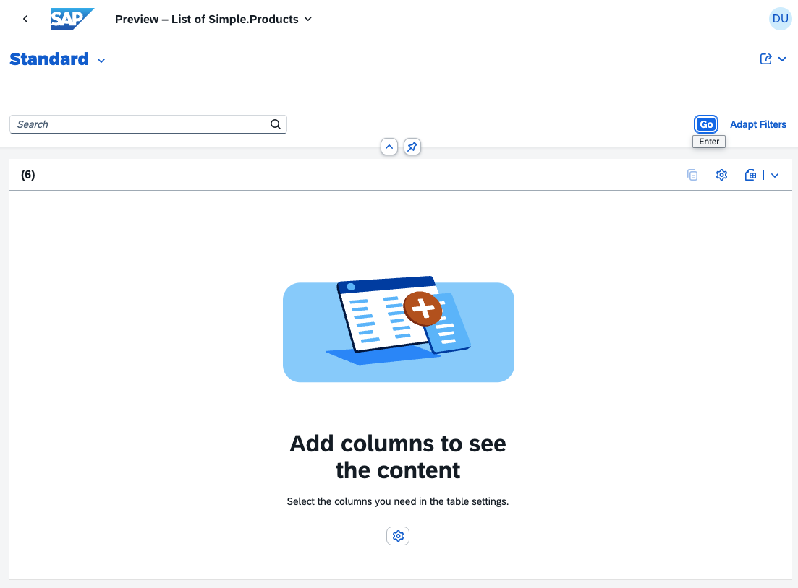
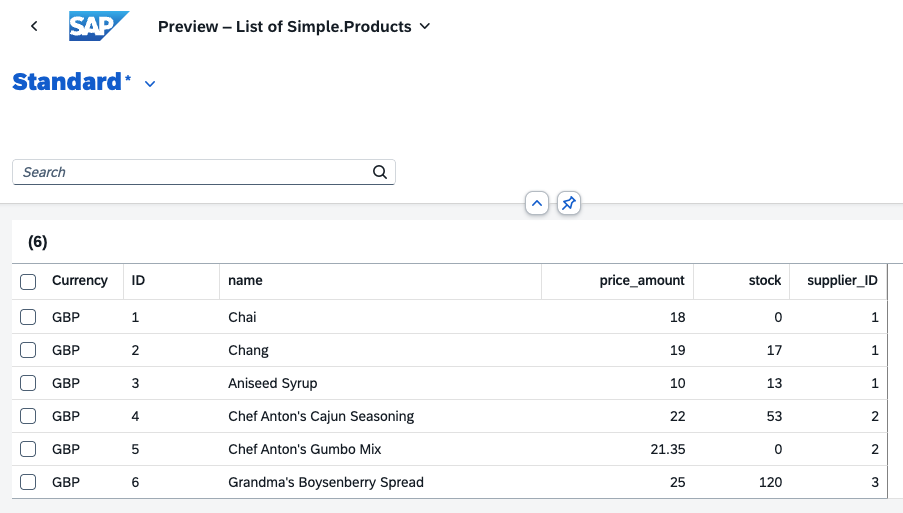

# 13 - An introduction to annotations

Until now, we've studiously avoided
[annotations](https://cap.cloud.sap/docs/cds/cdl#annotations). They're
important, but would have distracted us too much in the early stages. But now
it's time to take a first look.

## Revisit annotations we've seen so far

We first came across some when we [looked at the reuse library
source](../05#look-at-the-reuse-library-source), so let's revisit them now to
get a feel for how & where they are written and for what purposes they can be
used.

```cds
type Currency : Association to sap.common.Currencies;

context sap.common {

  entity Currencies : CodeList {
    key code      : String(3) @(title : '{i18n>CurrencyCode}');
        symbol    : String(5) @(title : '{i18n>CurrencySymbol}');
        minorUnit : Int16     @(title : '{i18n>CurrencyMinorUnit}');
  }

  aspect CodeList @(
    cds.autoexpose,
    cds.persistence.skip : 'if-unused'
  ) {
    name  : localized String(255)  @title : '{i18n>Name}';
    descr : localized String(1000) @title : '{i18n>Description}';
  }

}
```

👉 Look at the [annotation
syntax](https://cap.cloud.sap/docs/cds/cdl#annotation-syntax) information to
see that annotations are prefixed with `@`, can appear in different places, and
multiple annotations that apply to the same target can be sometimes enclosed in
brackets. Sometimes, the brackets that are designed to enclose multiple
annotations only actually contain a single annotation, as here in the `@title`
annotations[<sup>1</sup>](#footnotes) for the elements in `Currencies`.

The `@title` annotation is one of two [general purpose](https://cap.cloud.sap/docs/cds/annotations#general-purpose) annotations:

|Annotation|Alternative|
|`@title`|`@Common.Label`|
|`@description`|`@Core.Description`|

Think of them as short forms of the alternatives. But what are the
alternatives, what are those "Common" and "Core" prefixes? They relate to
annotations in OData. Taking the first alternative as an example, "Common" is a
vocabulary, and "Label" is a term within that vocabulary.

👉 Look at the list of standard annotation vocabularies:

- from OASIS[<sup>2</sup>](#footnotes):
  <https://oasis-tcs.github.io/odata-vocabularies/>
- from SAP: <https://sap.github.io/odata-vocabularies/>

to find the
[Common](https://sap.github.io/odata-vocabularies/vocabularies/Common.html)
(from SAP) and
[Core](https://oasis-tcs.github.io/odata-vocabularies/vocabularies/Org.OData.Core.V1.html)
(from OASIS) vocabularies, and identify the corresponding terms.

We see that:

- `@title`, via `@Common.Label`, is "A short, human-readable text suitable for
  labels and captions in UIs"
- `@description`, via `@Core.Description`, is "A brief description of a model
  element"

> For portability as well as simplicity, [the protocol-agnostic versions are
> preferred](https://cap.cloud.sap/docs/guides/uis/fiori#prefer-title-and-description).

Let's try our first annotation out, by applying a `@title` annotation to an
elemenet in one of our entities.

👉 First, call up the products Fiori preview via the link in the CAP server
landing page:


👉 Now use the settings icon to select all six columns for the table:



👉 Notice that the column headings are based on the actual element names right
now:



👉 Now, in `db/schema.cds`, annotate the `name` element in the `Products`
entity. Choose from this list of options the way you'd like to do it:

- In the same file, applied directly:

    - Postfix: the same way as the example above, without brackets:

        ```cds
        entity Products : cuid {
            name     : String @title: 'Product Name';
            stock    : Integer;
            price    : Price;
            supplier : Association to Suppliers;
        }
        ```

        or

        ```cds
        entity Products : cuid {
            name     : String @(title: 'Product Name');
            stock    : Integer;
            price    : Price;
            supplier : Association to Suppliers;
        }
        ```

    - Prefix: before the element name (again, with or without brackets):

        ```cds
        entity Products : cuid {
            @title: 'Product Name'
            name     : String;
            stock    : Integer;
            price    : Price;
            supplier : Association to Suppliers;
        }
        ```

- In a new file `db/text-annotations.cds`, organising your CDS model into separate concerns, and using the [annotate](https://cap.cloud.sap/docs/cds/cdl#the-annotate-directive) directive:

- Single element reference:

    ```cds
    using workshop from './schema';

    annotate workshop.Products : name with @title: 'Product Name';
    ```

- Block reference:

    ```cds
    using workshop from './schema';

    annotate workshop.Products with {
        name @title: 'Product Name';
    }
    ```

---

## Footnotes

1. The value of the `@title` annotations are identifiers in a [Resource
   Model](https://ui5.sap.com/#/topic/91f122a36f4d1014b6dd926db0e91070) like
   mechanism which allows us to maintain actual texts in multiple languages
   (the model name "i18n" stands for "internationalisation").
