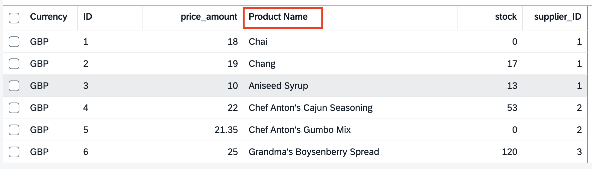

# 13 - An introduction to annotations

Until now, we've studiously avoided
[annotations](https://cap.cloud.sap/docs/cds/cdl#annotations). They're
important, but would have distracted us too much in the early stages. But now
it's time to take a first look.

## Revisit annotations we've seen so far

We first came across some when we [looked at the reuse library
source](../05#look-at-the-reuse-library-source).

👉 Take a moment to study these now, to get a feel for how they are written and
for what purposes they can be used:

```cds
type Currency : Association to sap.common.Currencies;

context sap.common {

  entity Currencies : CodeList {
    key code      : String(3) @(title : '{i18n>CurrencyCode}');
        symbol    : String(5) @(title : '{i18n>CurrencySymbol}');
        minorUnit : Int16     @(title : '{i18n>CurrencyMinorUnit}');
  }

  aspect CodeList @(
    cds.autoexpose,
    cds.persistence.skip : 'if-unused'
  ) {
    name  : localized String(255)  @title : '{i18n>Name}';
    descr : localized String(1000) @title : '{i18n>Description}';
  }

}
```

👉 Refer to the [annotation
syntax](https://cap.cloud.sap/docs/cds/cdl#annotation-syntax) information to
see that annotations are prefixed with `@`, can appear in different places, and
multiple annotations that apply to the same target can be enclosed in
brackets. Sometimes, the brackets that are designed to enclose multiple
annotations only actually contain a single annotation, as here in the `@title`
annotations[<sup>1</sup>](#footnotes) for the elements in `sap.common.Currencies`.

### Explore the @title annotation

The `@title` annotation is one of two [general
purpose](https://cap.cloud.sap/docs/cds/annotations#general-purpose)
annotations:

|Annotation|Alternative|
|-|-|
|`@title`|`@Common.Label`|
|`@description`|`@Core.Description`|

Think of them as short forms of the alternatives. But what are the
alternatives - what are those "Common" and "Core" prefixes? They relate to
annotations in OData. Taking the first alternative as an example, "Common" is a
vocabulary, and "Label" is a term within that vocabulary.

👉 Look at the list of standard annotation vocabularies:

- from OASIS[<sup>2</sup>](#footnotes):
  <https://oasis-tcs.github.io/odata-vocabularies/>
- from SAP: <https://sap.github.io/odata-vocabularies/>

👉 Find the
[Common](https://sap.github.io/odata-vocabularies/vocabularies/Common.html)
(from SAP) and
[Core](https://oasis-tcs.github.io/odata-vocabularies/vocabularies/Org.OData.Core.V1.html)
(from OASIS) vocabularies, and identify the corresponding terms.

We see that:

- `@title`, via `@Common.Label`, is "A short, human-readable text suitable for
  labels and captions in UIs"
- `@description`, via `@Core.Description`, is "A brief description of a model
  element"

> For portability as well as simplicity, [the protocol-agnostic versions are
> preferred](https://cap.cloud.sap/docs/guides/uis/fiori#prefer-title-and-description).

Let's try out our first annotation, by applying a `@title` annotation to an
element in one of our entities.

👉 Before we do, call up the Fiori preview for Products via the link in the CAP
server landing page at <http://localhost:4004>:


👉 In its basic unconfigured form, you'll need to add columns to be able to see
data:


👉 Use the settings icon shown to select all the columns for the table:

👉 Observe that the column headings in the table that is produced are based on
the resolved and flattened element names by default ("Currency", "ID", "name",
"price_amount", etc):


Let's improve the heading for one of the columns.

👉 In `db/schema.cds`, annotate the `name` element in the `Products`
entity, by choosing just one approach from this list of options:

- Either in the same file, applied directly:

  - Either "postfix": the same way as the example above, without brackets:
  
      ```cds
      entity Products : cuid {
          name     : String @title: 'Product Name';
          stock    : Integer;
          price    : Price;
          supplier : Association to Suppliers;
      }
      ```

      Or with brackets:

      ```cds
      entity Products : cuid {
          name     : String @(title: 'Product Name');
          stock    : Integer;
          price    : Price;
          supplier : Association to Suppliers;
      }
      ```

  - Or "prefix": before the element name (again, with or without brackets):

      ```cds
      entity Products : cuid {
          @title: 'Product Name'
          name     : String;
          stock    : Integer;
          price    : Price;
          supplier : Association to Suppliers;
      }
      ```

- Or in a new file `db/text-annotations.cds`, organising your CDS model into
  separate concerns[<sup>3</sup>](#footnotes), and using the
  [annotate](https://cap.cloud.sap/docs/cds/cdl#the-annotate-directive)
  directive (to be able to refer to the target of the annotation, rather than
  "decorate" it directly in situ):

  - Either using a single element reference:

      ```cds
      using workshop from './schema';

      annotate workshop.Products : name with @title: 'Product Name';
      ```

  - Or using a block reference:

      ```cds
      using workshop from './schema';

      annotate workshop.Products with {
          name @title: 'Product Name';
      }
      ```

Once you've made and saved the addition of the annotation, the CAP server
should restart as normal.

👉 Head back over to the products Fiori preview, select the columns again, and
take a look at the effect of this `@title` annotation:



### See how the annotations are exposed

How do these annotations work, how do they affect the UI? The `@title` and
`@description` annotations we've looked at here, and many many others, are
OData related. So let's follow that thread.

👉 Request the OData metadata for the `Simple` service at
<http://localhost:4004/simple/$metadata>, and you should see the effect of the
annotation you've added.

First, we have the entity type definition, which we've seen before:

```xml
<EntityType Name="Products">
  <Key>
    <PropertyRef Name="ID"/>
  </Key>
  <Property Name="ID" Type="Edm.Int32" Nullable="false"/>
  <Property Name="name" Type="Edm.String"/>
  <Property Name="stock" Type="Edm.Int32"/>
  <Property Name="price_amount" Type="Edm.Decimal" Scale="variable"/>
  <NavigationProperty Name="price_currency" Type="Simple.Currencies">
    <ReferentialConstraint Property="price_currency_code" ReferencedProperty="code"/>
  </NavigationProperty>
  <Property Name="price_currency_code" Type="Edm.String" MaxLength="3"/>
  <NavigationProperty Name="supplier" Type="Simple.Suppliers" Partner="products">
    <ReferentialConstraint Property="supplier_ID" ReferencedProperty="ID"/>
  </NavigationProperty>
  <Property Name="supplier_ID" Type="Edm.Int32"/>
</EntityType>
```

And there is now annotation information in the metadata, using the
"alternative" (OData) term `Common.Label`[<sup>4</sup>](#footnotes) with the
value we specified:

```xml
<Annotations Target="Simple.Products/name">
  <Annotation Term="Common.Label" String="Product Name"/>
</Annotations>
```

The Fiori elements framework uses this to adjust the UI accordingly.

### Look briefly at the other annotations in the reuse library source

There were another couple of annotations earlier:

```cds
aspect CodeList @(
  cds.autoexpose,
  cds.persistence.skip : 'if-unused'
) {
  name  : localized String(255)  @title : '{i18n>Name}';
  descr : localized String(1000) @title : '{i18n>Description}';
}
```

Briefly:

- [@cds.autoexpose](https://cap.cloud.sap/docs/guides/services/providing-services#auto-exposed-entities)
  controls whether a _referenced_ entity is exposed in a service
- [@cds.persistence.skip](https://cap.cloud.sap/docs/guides/databases/cdl-to-ddl#cds-persistence-skip)
  controls whether artifacts are created at the persistence layer for entities

Note that the annotations here apply to whatever entities are extended with the
`CodeList` aspect[<sup>5</sup>](#footnotes).

### Add one more UI specific annotation

In using the Fiori preview so far we've had to specify the columns for the
table each time we've used the preview. We can use an annotation to pre-define
the columns, so that this is not a burden on the user. Let's round out this
exercise by adding that.

> We'll make an exception for this workshop and create a new CDS file in the
> `app/` directory here, as arguably that's where it belongs, containing
> annotations for purely UI configuration.

👉 In the `app/` directory of the project create a file `general.cds` with the
following content:

```cds
using workshop from '../db/schema';

annotate workshop.Products with @UI.LineItem: [
    {Value: name},
    {Value: stock}
]
```

This adds the `@UI.LineItem` annotation to the `Products` entity as a whole.
This is an annotation that relates directly to the corresponding `LineItem`
term in the OData [UI
vocabulary](https://sap.github.io/odata-vocabularies/vocabularies/UI.html) from
SAP, and has a description thus: "Collection of data fields for representation
in a table or list".

👉 Once the CAP server has restarted, revisit the [products Fiori
preview](http://localhost:4004/$fiori-preview/Simple/Products#preview-app)
where the table should be immediately presented, without a request to
choose columns:


> Notice how the compilation of the CDS model has ensured that all annotations
> are coalesced!

### Annotations annotations annotations!

(With [apologies to Hawkwind](https://en.wikipedia.org/wiki/Levitation_(Hawkwind_album)#Track_listing))

This is just the tip of the iceberg with respect to annotations, the subject of
which is easily large enough to fill an entire workshop itself. So we'll leave
it here with respect to the introduction, but will be employing annotations in
the next exercise too.

---

[Next](../14/)

---

## Footnotes

1. The value of the `@title` annotations are identifiers in a [Resource
   Model](https://ui5.sap.com/#/topic/91f122a36f4d1014b6dd926db0e91070) like
   mechanism which allows us to maintain actual texts in multiple languages
   (the model name "i18n" stands for "internationalisation").

1. The Organization for the Advancement of Structured Information Standards,
   also known as OASIS Open, is an industry consortium that develops technical
   standards for information technology. One of the standards they look after
   is that of OData.

1. See best practice [BES005 Factor out separate
   concerns](https://github.com/qmacro/capref/blob/main/bestpractices/BES005.md).

1. Not to be confused with the corresponding actual CDS level annotation
   `@Common.Label`. But they are very much directly related, of course.

1. Useful for `CodeList` based entities used in Value List UI controls.
