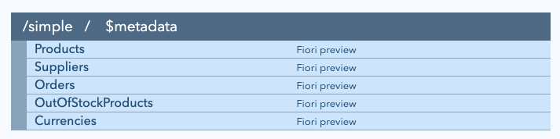

# 15 - Shift left, avoid procedural code

In this last exercise, we'll double down on the declarative approach we've
explored thus far, and look to see how else we can use the same approach to
avoid custom code, and to embrace more powerful facilities that CDS modelling
has to offer, linked to a key reason to use CAP - [the code is in the
framework, not outside of
it](https://qmacro.org/blog/posts/2024/11/07/five-reasons-to-use-cap/#1-the-code-is-in-the-framework-not-outside-of-it).

The concept of [shifting
left](https://qmacro.org/blog/posts/2026/02/09/shift-left-with-cap/) was
introduced right at the end of the previous exercise. The tasks described in
this exercise explore that idea further.

## Replace the function in exercise 11 with a declarative infix filter

The function we chose to specify and implement in [exercise 11](../11/) was
deliberately simple, of course. But did you know that we don't even need custom
code for such a facility?

One of the best features of developing with the CAP framework is that it allows
us to push out logic and mechanics to the extremities:

- upwards to the declarative surface area of our domain model (and related
  service definitions)
- downwards to the persistence layer where complex queries can be handled
  directly and natively by the database systems

Let's make available that same feature (the listing of products that are out of
stock) without having to write a single line of custom code.

### Remove the custom implementation

👉 Start out by deleting the `srv/ecommerce.js` file that we created when we
[provided the implementation in exercise
11](../11/README.md#provide-an-implementation) as we don't need it any more.
Deleting code (while the app or service still does what you want) is a much
underrated power move! For reference and comparison with what we're about to
define, here's the salient part of the custom code (although the point also
is that in order for this custom code to exist in the right calling context,
more code was needed):

```javascript
this.on('outOfStockProducts', async () => {
    return await SELECT.from(Products).where({ stock: 0 })
})
```

### Redefine the facility as a projection

👉 Next, remove the `outOfStockProducts()` function definition from the
`Simple` service, replacing it with another entity projection called
`OutOfStockProducts` as shown below. Also, add the annotation
`@cds.redirection.target` to the `Products` entity projection. Once you're
done, the `Simple` service definition should look like this:

```cds
@protocol: 'odata'
@path    : '/simple'
service Simple {
  @cds.redirection.target
  entity Products           as projection on workshop.Products;

  entity Suppliers          as projection on workshop.Suppliers;
  entity Orders             as projection on workshop.Orders;
  entity OutOfStockProducts as projection on workshop.Products[stock <= 0];
}
```

### Examine what we've done

What have we done here? Importantly, we have:

- moved from a procedural approach that required custom business logic,
  to a purely declarative one using the power of CAP's domain modelling
  language CDL
- that power specifically here is the `[stock <= 0]` part which is an [infix
  filter](https://cap.cloud.sap/docs/cds/cdl#publish-associations-with-filter)

Unrelated directly to the use of an infix filter, and more related to the fact
that we have defined a second projection on the same base entity
(`workshop.Products`), we have also:

- added the annotation
  [@cds.redirection.target](https://cap.cloud.sap/docs/cds/cdl#using-cds-redirection-target-annotations)
  to help the compiler resolve any ambiguity between the two possible
  destinations for association based relationships

Now that we've made these changes and got rid of the `srv/ecommerce.js` file,
make sure the CAP server has restarted and visit the CAP server home page again
at <http://localhost:4004/>, where this new resource is exposed, as an entity
this time of course, and not as a function:



👉 Select that entity link to get to the entityset resource, which should
reflect the same data as the function did: the products "Chai" and "Chef
Anton's Gumbo Mix".

## Explore more declarative possibilities

We've just "shifted left" some custom code, into a declarative service
definition in the `srv/` layer. Sometimes it makes sense to go "even further
left" to the `db/` layer, declaring constructs that benefit all services that
rely on the definitions there.

In this section we'll extend our definitions at the `db/` layer by adding some
[calculated elements](https://cap.cloud.sap/docs/cds/cdl#calculated-elements).

We'll make all the changes first, and then review the outcome at the end.

### Add stock value information

It's not unlikely that consumers of product data may wish to know the total
stock values. Referring to the diagram in the [Shift left with
CAP](https://qmacro.org/blog/posts/2026/02/09/shift-left-with-cap/) blog post:

```text
+---------+     +---------+     +---------+     +---------+
| Entity  |     | Service |     |  OData  |     |         |
| Model   +-----+ Defn    +-----+  Proto  +-----|Frontend |
|         |     |         |     |         |     |         |
+---------+     +----+----+     +---------+     +---------+
                     |
                +----+----+
                | Service |
                | Impl    |
                |         |
                +---------+
```

the calculation of the total stock value could be done in any of the stages
shown, and it's often on the far right, at the frontend.

But if we shift that calculation left to the entity model at the `db/` layer,
everyone and everything downstream (right) benefits.

👉 Add a new element called `value` to the `Products` entity in `db/schema.cds`:

```cds
entity Products : cuid {
    name     : String;
    stock    : Integer;
    price    : Price;
    value    : Decimal = price.amount * stock;
    supplier : Association to Suppliers;
}
```

It's as simple as that.

### Allow the retrieval of only premium products

Related to value is product price, and assuming that products with a high price
are "premium" products, we can add an element to the `Suppliers` entity that
represents a link to that supplier's premium offerings.

👉 Add a new element called `premiumproducts` to the `Suppliers` entity like
this:

```cds
entity Suppliers : cuid {
    company  : String;
    products : Association to many Products
                   on products.supplier = $self;
    premiumproducts = products[price.amount >= 22];
}
```

> The value of `22` here is based on the [deliberately limited
> dataset](../07/assets/workshop-Products.csv) we are working with, and is
> designed to show some but not all products.

This is known as an [association-like calculated
element](https://cap.cloud.sap/docs/cds/cdl#association-like-calculated-elements)[<sup>1</sup>](#footnotes)
and is similar to the infix filter we used in the projection at the `srv/`
layer at the start of this exercise.

### Maintain a lowercase version of the company name

Searching string-like values often is complicated by case. So having a
normalised version of a search target is sometimes useful. We can add a
calculated element to the `Suppliers` entity with the extra `stored` keyword,
to have an [on-write](https://cap.cloud.sap/docs/cds/cdl#on-write) mechanism
that will be persisted.

👉 Add another new element called `searchname` to the `Suppliers` entity like this:

```cds
entity Suppliers : cuid {
    company    : String;
    products   : Association to many Products
                     on products.supplier = $self;
    premiumproducts = products[price.amount >= 22];
    searchname : String = (
        tolower(company)
    ) stored;
}
```

Using one of the string functions (`tolower`) in the set of [standard
functions](https://cap.cloud.sap/docs/guides/databases/cap-level-dbs#standard-functions)
that CAP supports across all databases, we can store and make available a
lowercased version of the company names.

### Try out the new elements

Let's first add a new supplier, to explore the `stored` feature we've just used.

👉 Check that the CAP server is still running, and send an OData Create operation as follows:

```bash
curl \
  --silent \
  --include \
  --data '{"company": "SAP"}' \
  --header 'Content-Type: application/json' \
  --url localhost:4004/simple/Suppliers \
  | grep ^HTTP
```

This should cause the creation of a new record and show the appropriate status code:

```text
HTTP/1.1 201 Created
```

Now let's request the suppliers and their premium products, with an OData Query operation that includes an "expand" on the `premiumproducts` navigationpath that now exists: <http://localhost:4004/simple/Suppliers?$expand=premiumproducts>. This should return something like this:

```json
{
  "@odata.context": "$metadata#Suppliers",
  "value": [
    {
      "ID": 1,
      "company": "Exotic Liquids",
      "searchname": "exotic liquids",
      "premiumproducts": []
    },
    {
      "ID": 2,
      "company": "New Orleans Cajun Delights",
      "searchname": "new orleans cajun delights",
      "premiumproducts": [
        {
          "ID": 4,
          "name": "Chef Anton's Cajun Seasoning",
          "stock": 53,
          "price_amount": 22,
          "price_currency_code": "GBP",
          "value": 1166,
          "supplier_ID": 2
        }
      ]
    },
    {
      "ID": 3,
      "company": "Grandma Kelly's Homestead",
      "searchname": "grandma kelly's homestead",
      "premiumproducts": [
        {
          "ID": 6,
          "name": "Grandma's Boysenberry Spread",
          "stock": 120,
          "price_amount": 25,
          "price_currency_code": "GBP",
          "value": 3000,
          "supplier_ID": 3
        }
      ]
    },
    {
      "ID": 4,
      "company": "SAP",
      "searchname": "sap",
      "premiumproducts": []
    }
  ]
}
```

In this entityset we can see:

- the lowercased company names, including the one for the supplier (SAP) we
  just added
- the list of zero or more "premium" (price more than 22) products per supplier
- the value of each product (being the price multiplied by the stock)

All this, with no custom coding, no JavaScript or Java service layer. In fact,
we are still effectively at the same stage we [we started the
project](01#start-a-new-cap-project), with no specific runtime (JavaScript or
Java) needing to be specified[<sup>2</sup>](#footnotes).

That's all we have time for in this workshop. Well done for reaching the end!

---

## Footnotes

1. See also the [Association-like calculated
   element](https://qmacro.org/blog/posts/2026/03/27/cds-expressions-in-cap-notes-on-part-4/#association-like-calculated-element)
   section of the notes to the live stream episode 4 on CXL.

1. This is of course more illustrative and philosophical, as there is a runtime
   that is facilitating everything here, the one that belongs to the globally
   installed CAP development kit. But the point is that we've come this far and
   not had to create any custom code.
