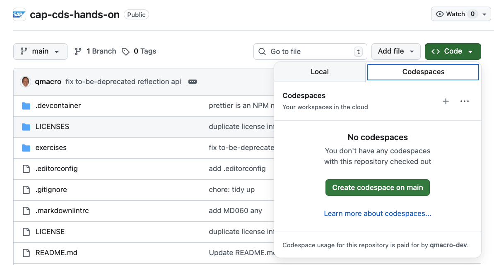

# Prerequisites

In order to work through the exercises you'll need a development environment
for CAP Node.js, with the latest version of the CDS Development Kit.

## Options

For this, you have various options. They are presented here in order of
increasing complexity and setup effort (but they are all very achievable).

### In combination with GitHub Codespaces

For this option, all you will need is a (free) account on
[GitHub](https://github.com).

You can use the [Codespaces](https://github.com/features/codespaces) facility
to get a development environment directly in your browser.

From this repo's home page on GitHub, use the "Code" button, and within the
"Codespaces" tab, choose to "Create codespace on main" as shown here:

> [!IMPORTANT]
> GitHub Codespaces are free for a specific length of time during the month.
> It's more than enough time for this CodeJam, but please remember to delete
> the Codespace at the end of the day (there's an "autodelete" feature you can
> set for this).

### Using VS Code and a container manager

For this option you will need [VS Code](https://code.visualstudio.com/)
installed, with the [Dev Containers
extension](https://marketplace.visualstudio.com/items?itemName=ms-vscode-remote.remote-containers).
You will also need a container manager such as [Docker
Desktop](https://docs.docker.com/desktop/) or [Podman](https://podman.io/).

Clone this repository to your machine or download the ZIP file and unpack it.
Open the cloned or unpacked directory in VS Code, whereupon you should be
presented with an option to “Reopen in container” (which you should select):

### Manual setup

You can follow the [Getting
Started](https://cap.cloud.sap/docs/get-started/) guide in Capire (CAP's
official documentation), ensuring you have the latest version of `@sap/cds-dk`
(the development kit).

This option gives you complete control of your setup, but you are ultimately
responsible for setting it up, and also working through the nuances that naturally
occur from different shell and operating system environments.
